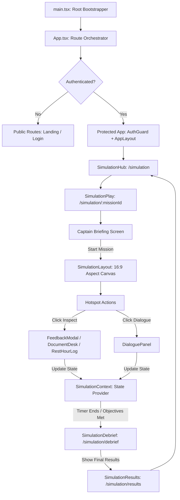

# ProjectSeaT: Architecture and Simulator Execution Map

This document describes the codebase architecture of **ProjectSeaT**, mapping the runtime flow from the initial entry point to active simulation execution and state synchronization.

---

## 1. High-Level Flow Chart

The diagram below maps the application lifecycle from bootstrapping to simulator execution:



---

## 2. Bootstrapping & Routing Entry Points

### 2.1 Bootstrapper
- **[`src/main.tsx`](file:///c:/Users/admin/Documents/ProjectSeaT/src/main.tsx)**: Initializes the React application, loading global styling (`src/index.css`) and importing the root layout from `src/App.tsx`.

### 2.2 App Contexts & Route Registry
- **[`src/App.tsx`](file:///c:/Users/admin/Documents/ProjectSeaT/src/App.tsx)**: Binds the global state providers and registers both public and protected routes:
  - **`AuthProvider` ([`src/contexts/AuthContext.tsx`](file:///c:/Users/admin/Documents/ProjectSeaT/src/contexts/AuthContext.tsx))**: Manages seafarer authentication profiles and session logs.
  - **`AppProvider` ([`src/contexts/AppContext.tsx`](file:///c:/Users/admin/Documents/ProjectSeaT/src/contexts/AppContext.tsx))**: Manages top-level dashboard sidebar toggle modes and global workspace settings.
  - **`SimulationProvider` ([`src/simulation/state/SimulationContext.tsx`](file:///c:/Users/admin/Documents/ProjectSeaT/src/simulation/state/SimulationContext.tsx))**: Single source of truth for simulator status, clocks, scores, and interactive logs.

### 2.3 Route Structure
```
/ (Root Dashboard)                 ──> Dashboard modules, activity summaries
  ├── /landing                     ──> Public home page
  ├── /init                        ──> Port breakdown / offboarding animation sequence
  ├── /login                       ──> Seafarer auth credentials gateway
  ├── /profile                     ──> Seafarer status, ranks, & badges
  ├── /simulation                  ──> SimulationHub (Mission selection)
  ├── /simulation/:missionId       ──> SimulationPlay (Active simulator)
  ├── /simulation/debrief          ──> SimulationDebrief (Mission audit checklist review)
  └── /simulation/results          ──> SimulationResults (XP rewards & badge ceremony)
```

---

## 3. Simulator Layout & Component Hierarchy

Once a mission is started, the route `/simulation/:missionId` loads **[`SimulationPlay.tsx`](file:///c:/Users/admin/Documents/ProjectSeaT/src/simulation/routes/SimulationPlay.tsx)**, which handles the initial briefing and renders **[`SimulationLayout.tsx`](file:///c:/Users/admin/Documents/ProjectSeaT/src/simulation/layouts/SimulationLayout.tsx)**.

### 3.1 16:9 Viewport Canvas Container
The simulator workspace is strictly locked inside a single 16:9 aspect-ratio canvas. All interface widgets sit as absolute overlays directly on top of the active viewport background to prevent scrollbars:

```
+-----------------------------------------------------------------+
| [MissionHeader]                                                 |
| Score: 100 PTS | Inspector Trust: 100% | Timer: 09:59           |
|                                                                 |
| [SceneContainer]                                                |
| Background Image (e.g. ship_office, bridge)                     |
|                                                                 |
|    (Hotspot Layer)                      [ObjectivePanel]        |
|    - [Document Desk Hotspot]            List of requirements    |
|    - [Inspector Hotspot]                and check status        |
|                                                                 |
|                                                                 |
| [DialoguePanel]                                                 |
| Custom speakers choices overlay                                 |
|                                                                 |
| [Description & Hint Footers]                                    |
| Scene desc / Location helper instructions                       |
+-----------------------------------------------------------------+
```

### 3.2 Key Layout Components
- **[`SceneContainer.tsx`](file:///c:/Users/admin/Documents/ProjectSeaT/src/simulation/components/SceneContainer.tsx)**: Displays the background image for the current scene (using `object-cover` inside a 16:9 canvas card) and overlay-positions interactive hotspots.
- **[`MissionHeader.tsx`](file:///c:/Users/admin/Documents/ProjectSeaT/src/simulation/components/MissionHeader.tsx)**: HUD displaying the mission timer, score, inspector trust meter, and pause button.
- **[`ObjectivePanel.tsx`](file:///c:/Users/admin/Documents/ProjectSeaT/src/simulation/components/ObjectivePanel.tsx)**: Right-floated checklists detailing current objectives and point values.
- **[`MissionFooter.tsx`](file:///c:/Users/admin/Documents/ProjectSeaT/src/simulation/components/MissionFooter.tsx)**: Absolute-bottom floating help bar displaying location-based hints.

### 3.3 Keyboard Accessibility (ESC Close Event Handlers)
To support keyboard accessibility, all overlay panels bind to the global window `keydown` listener to handle keyboard escape closures when the `Escape` key is pressed:
- **Pause Menu Overlay** (`MissionOverlay.tsx`)
- **Document Inspection Desk Clipboard** (`DocumentDesk.tsx`)
- **MLC Rest Hours logs Audit Panel** (`RestHourLog.tsx`)
- **Interactive Feedback Modal** (`FeedbackModal.tsx`)
All listeners are automatically unbound on component unmounts to prevent memory leaks.

---

## 4. State Management & Lifecycle

**[`SimulationContext.tsx`](file:///c:/Users/admin/Documents/ProjectSeaT/src/simulation/state/SimulationContext.tsx)** manages state transitions and calculations:

### 4.1 State Structure
```typescript
interface PlayerState {
  score: number
  completedObjectiveIds: string[]
  inventory: string[]
  decisionsMade: Record<string, string>
  attempts: Record<string, number>
  trustScore: number
  documentChecked: boolean
  restHoursChecked: boolean
}

interface SimulationState {
  currentMissionId: string | null
  currentSceneId: string | null
  playerState: PlayerState
  activeDialogueId: string | null
  timeRemaining: number | null
  status: 'idle' | 'running' | 'paused' | 'debrief' | 'results' | 'failed'
  activeFeedback: FeedbackDetail | null
  activeDocumentDesk: boolean
  activeRestHourLog: boolean
}
```

### 4.2 Lifecycle Event Handlers
1. **`startMission(missionId)`**: Sets the status to `running`, resets seafarer stats (trust=100, score=0), and initializes the timer.
2. **`transitionToScene(sceneId)`**: Switches the active viewport background and resets active modals.
3. **`triggerHotspot(hotspotId)`**: Resolves hotspot interactions (triggers inspections, starts dialogue trees, or mounts audit panels).
4. **`makeDialogueChoice(choiceId)`**: Transitions dialogue nodes and applies scoring/trust impacts.
5. **`completeDocumentAudit()` & `completeRestHourAudit()`**: Awards points, updates trust based on deficiencies identified, and checks off objectives.
6. **Tick loop**: Decrements `timeRemaining` every second. If time reaches `0` before completion, sets status to `failed`.
7. **Debrief transition**: When all objectives are checked, changes status to `debrief` and redirects the user to the debrief results dashboard.

---

## 5. Simulation Engine & Services Layers

The subsystem leverages helper services and engines designed for extensibility:

### 5.1 Business Logic Services ([`src/simulation/services/index.ts`](file:///c:/Users/admin/Documents/ProjectSeaT/src/simulation/services/index.ts))
- **`MissionService`**: Fetches configuration blueprints and catalogs.
- **`SceneService`**: Pre-fetches high-definition images and hotspots metadata.
- **`EventService`**: Logs telemetry analytics to the server.
- **`RewardService`**: Posts scores, awards XP, and updates ranks.
- **`ProgressService`**: Saves checkpoints to IndexedDB / local storage.

### 5.2 Decoupled Engines ([`src/simulation/engine/index.ts`](file:///c:/Users/admin/Documents/ProjectSeaT/src/simulation/engine/index.ts))
- **`SimulationEngine`**: General orchestrator managing ticks, configurations, and core resets.
- **`MissionEngine`**: Handles objective completion logic and checklist scoring.
- **`SceneEngine`**: Coordinates transition maps and bounds hotspot click coordinates.
