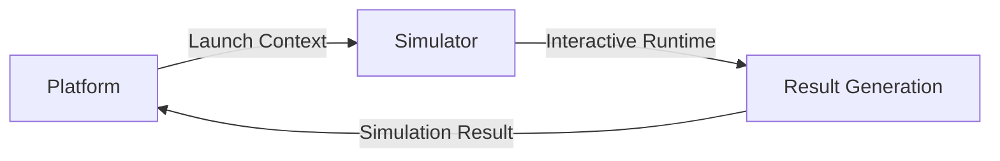

# Maritime Training Platform | Project Structure

This document outlines the codebase organization, directory structure, and high-level architecture rules for the Maritime Training Platform Frontend.

## 1. High-Level Domain Architecture

ProjectSeaT is divided into two major application domains which must remain logically separated:

1. **Platform**: The application orchestrator. It owns the broader application experience including public landing pages, learner dashboard, settings, profiles, leaderboard, and training/module discovery.
2. **Simulator**: The interactive training runtime. It owns mission runtime behavior, stage progressions, objective evaluations, hotspots, inspection logic, dialogues, and result generation.

### Conceptual Integration Flow

The integration boundary is defined by explicit TypeScript contracts (e.g. `SimulatorLaunchContext` and `SimulatorResult` inside the shared type directories) to prevent domain coupling.

## 2. Directory Architecture

The modular directory structure under the `src/` folder is organized as follows:

```text
src/
├── assets/                 # Global static assets (logos, illustrations)
├── Images/                 # App-specific images and ship graphics
├── components/             # Reusable Platform UI components
│   ├── common/             # Legacy/generic UI building blocks (reusable)
│   ├── ui/                 # Atomic design primitive elements (Button, Card, Badge, etc.)
│   ├── navigation/         # Header, Sidebar, Breadcrumbs, etc.
│   └── layout/             # Platform-wide shell layouts (e.g., AppLayout)
├── constants/              # Platform constant files and lookup maps
├── contexts/               # Platform-wide global React context state providers (Auth, App)
├── data/                   # Structured, static Platform-level local datasets
├── hooks/                  # Custom reusable React hooks for the Platform
├── mock/                   # Platform-level mock data representing unavailable API/backend services
├── pages/                  # Platform page-level screen components (Home, Modules, Profile, etc.)
│   └── landing/            # Authentication & Onboarding pages (LoginPage, InitializationScreen, etc.)
├── simulation/             # Bounded subsystem folder containing the entire Simulator runtime
│   ├── components/         # Simulator-specific UI elements (DialoguePanel, RestHourLog, etc.)
│   ├── config/             # Intentional Simulator & mission config defining runtime behavior
│   ├── engine/             # Reusable, non-visual simulation progression logic & scoring engines
│   ├── layouts/            # Simulator-specific viewport & HUD wrappers (SimulationLayout, DebriefLayout)
│   ├── mock/               # Simulator-specific mocked inputs, mocked services, or temp data
│   ├── routes/             # Simulator page-level screens (SimulationPlay, SimulationHub, etc.)
│   ├── services/           # Simulator persistence abstractions and synchronization services
│   ├── state/              # Simulator-internal runtime context and state management
│   ├── types/              # Simulator-internal TypeScript declarations and contracts
│   ├── utils/              # Reusable simulator-specific pure utility helpers
│   └── index.ts            # Public integration/export boundary for the Simulator subsystem
├── types/                  # Domain types genuinely shared across Platform and Simulator
├── utils/                  # Reusable Platform pure helper functions and formatters
├── App.css                 # Root application styling overrides
├── App.tsx                 # Main routing configurations and global state boundary
├── index.css               # Tailwind CSS directive imports and design token themes
└── main.tsx                # Application bootstrapping and React DOM mounting
```

## 3. Technology Stack

ProjectSeaT uses the following verified modern frontend technology stack:

- **Core Framework**: React 19.2 (`react` & `react-dom`)
- **Build Tool / Bundler**: Vite 8.1
- **Language**: TypeScript 6.0
- **Styling**: Tailwind CSS v4 using the native `@tailwindcss/vite` plugin.
- **Routing**: React Router v7 (`react-router-dom`)
- **Iconography**: Lucide React
- **Linter**: Oxlint 1.69 (ultra-fast linter configuration)
- **Module System**: ES Modules ("type": "module" in [package.json](file:///c:/Users/Vkhopkar/OneDrive%20-%20Magicsoftware/Documents/Project/ProjectSeaT/package.json))
- **Node.js Runtime Requirements**: Target runtime is `node >= 20.0.0` (specifically requiring `^20.19.0 || >=22.12.0` due to Rolldown/Vite engine requirements)

## 4. Key Configuration Files

- **Vite Configurations**: [vite.config.ts](file:///c:/Users/Vkhopkar/OneDrive%20-%20Magicsoftware/Documents/Project/ProjectSeaT/vite.config.ts) handles local bundling, port routing, path aliases, and the Tailwind CSS plugin.
- **TypeScript Configurations**: App-level configuration is managed in [tsconfig.app.json](file:///c:/Users/Vkhopkar/OneDrive%20-%20Magicsoftware/Documents/Project/ProjectSeaT/tsconfig.app.json), node utilities configuration in [tsconfig.node.json](file:///c:/Users/Vkhopkar/OneDrive%20-%20Magicsoftware/Documents/Project/ProjectSeaT/tsconfig.node.json), and the overall inheritance tree in [tsconfig.json](file:///c:/Users/Vkhopkar/OneDrive%20-%20Magicsoftware/Documents/Project/ProjectSeaT/tsconfig.json).
- **Deployment Configurations**: [vercel.json](file:///c:/Users/Vkhopkar/OneDrive%20-%20Magicsoftware/Documents/Project/ProjectSeaT/vercel.json) controls hosting configurations, redirects, and custom headers.
- **Dependency Map**: [package.json](file:///c:/Users/Vkhopkar/OneDrive%20-%20Magicsoftware/Documents/Project/ProjectSeaT/package.json) maps versions and scripts.

## 5. Main Application Routing

All application routing is declared inside [src/App.tsx](file:///c:/Users/Vkhopkar/OneDrive%20-%20Magicsoftware/Documents/Project/ProjectSeaT/src/App.tsx).
- **Public Routes**: Includes landing page flow (`/landing`, `/init`, `/login`, `/offboard`).
- **Platform Routes**: Includes core dashboard pages wrapper (`/`, `/modules`, `/leaderboard`, `/profile`, `/settings`, `/help`, `/design-system`).
- **Simulator Subsystem Routes**: Maintained under `/simulation` endpoints (`/simulation` for the Hub, `/simulation/:missionId/theory` for the Briefing Engine, `/simulation/:missionId` for runtime gameplay, `/simulation/debrief`, `/simulation/results`). All Simulator views are imported directly from the public integration boundary [src/simulation/index.ts](file:///c:/Users/Vkhopkar/OneDrive%20-%20Magicsoftware/Documents/Project/ProjectSeaT/src/simulation/index.ts).
